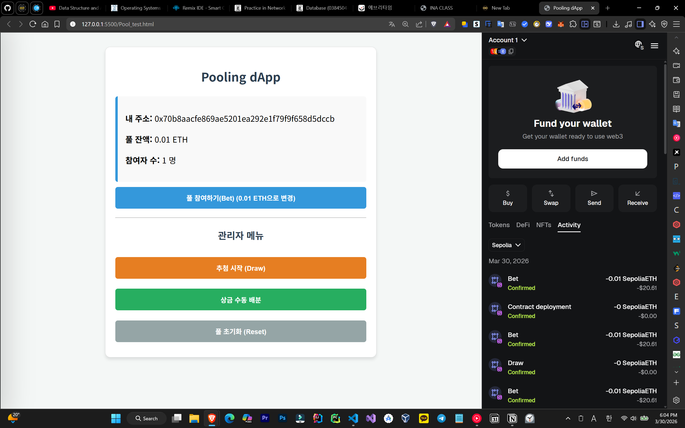

# 🏊‍♂️ Pooling dApp (Decentralized Lottery)

A simple, transparent, and functional decentralized lottery application built on the **Ethereum Sepolia Testnet**. Users can participate by sending a fixed amount of ETH, and the contract randomly selects a winner to receive the majority of the pool.

---

## 🚀 How It Works

1. **Participation (`bet`):** Users join the pool by sending exactly **0.01 ETH**. Their addresses are recorded on the blockchain.
2. **Selection (`draw`):** The contract owner triggers the drawing process. 
3. **Distribution:** - **90%** of the total pool is sent to the randomly selected winner.
   - **10%** is sent to the contract owner as a service fee.
4. **Automatic Reset:** Once the prizes are distributed, the participant list is cleared, and the pool is ready for a new round.

---

## 🛠 Tech Stack

- **Smart Contract:** Solidity `^0.8.18` (utilizing `prevrandao` for randomness)
- **Frontend:** HTML5, CSS3, JavaScript (Vanilla)
- **Blockchain Interaction:** [Web3.js](https://web3js.org/)
- **Wallet Integration:** MetaMask
- **Network:** Sepolia Testnet

---

## 🔧 Installation & Setup

### 1. Smart Contract Deployment
1. Open [Remix IDE](https://remix.ethereum.org/).
2. Create `Pool.sol` and paste the contract code.
3. Compile using version `0.8.18` or higher.
4. Deploy using **Injected Provider - MetaMask** on the **Sepolia Testnet**.

### 2. Frontend Configuration
1. Copy the **Contract Address** from Remix.
2. Copy the **ABI** from the Compiler tab in Remix.
3. Open your HTML file and update these variables:
   ```javascript
   const contractAddress = 'YOUR_DEPLOYED_ADDRESS_HERE';
   const abi = [ /* PASTE_YOUR_ABI_HERE */ ];
### 3. 👨‍💻 Screenshot
<p align="center">


### 🐴 Thank you!